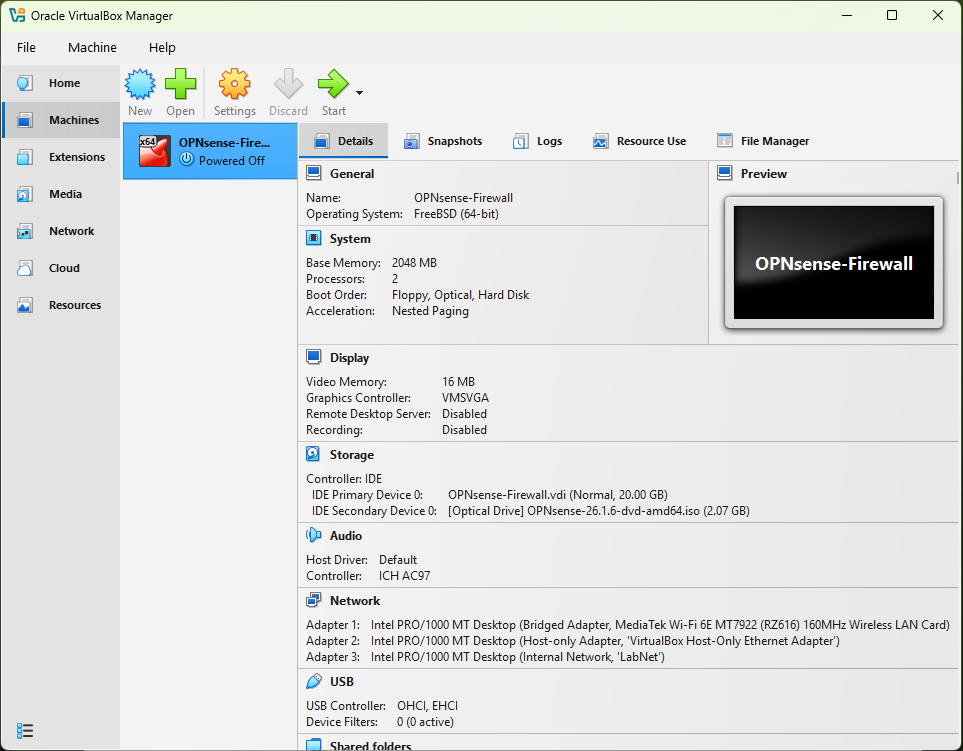

# Project Aegis: Virtualized Security Stack

## Project Overview
This project involves building a multi-zone virtualized network environment to study enterprise-grade networking and security. By using VirtualBox on a Windows host, I have simulated a real-world architecture featuring a dedicated firewall, a management network, and an isolated security testing zone.

## Network Topology
The lab is structured into three distinct zones to simulate a "Defense-in-Depth" strategy:
1. **WAN (Wide Area Network):** Bridged connection to the physical internet via the host Wi-Fi/Ethernet.
2. **LAN (Management):** A private Host-Only network (192.168.56.x) allowing secure web GUI access from the Windows host.
3. **Lab-NET (Internal):** A fully isolated virtual network (LabNet) for security testing, preventing any "blast radius" from reaching the host machine.

**Network Diagram**

---

## Technical Specifications

### Host Machine (Windows)
- **OS:** Windows 10/11
- **Virtualization:** AMD-V / Intel VT-x Enabled
- **Hypervisor:** VirtualBox 7.2.8 + Extension Pack

### Virtual Firewall (OPNsense)
- **OS Base:** FreeBSD 14 (HardenedBSD)
- **Resources:** 2 vCPUs, 2GB RAM
- **Storage:** 20GB VDI (ZFS File System)
- **Network Adapters:**
  - **Adapter 1:** Bridged (WAN)
  - **Adapter 2:** Host-Only (LAN Management)
  - **Adapter 3:** Internal Network (Isolated Lab)

---

## Installation and Progress Log

### Phase 1: Infrastructure and Firewall Deployment
- [x] **Hypervisor Setup:** Installed VirtualBox 7.2.8 and configured Host-Only Virtual Switch.
- [x] **VM Provisioning:** Created the OPNsense shell with 2GB RAM and 3-interface mapping.
- [x] **OS Installation:** Booting from ISO and installing OPNsense to virtual disk (ZFS).
- [x] **Interface Assignment:** Mapping em0, em1, and em2 to WAN, LAN, and OPT1.

**Proof of Configuration:**

---

## Security Roadmap
- **Phase 2:** Deployment of Kali Linux on the LabNet internal network.
- **Phase 3:** Implementing Suricata IDS/IPS to monitor and block malicious traffic patterns.
- **Phase 4:** Conducting Nmap Reconnaissance and Vulnerability Scanning against target VMs.

## Learning Outcomes
- **Network Segmentation:** Experience in creating isolated subnets to protect critical infrastructure.
- **NAT and Routing:** Understanding how a firewall handles traffic between public and private IPs.
- **Stateful Packet Inspection (SPI):** Learning how OPNsense tracks conversations to prevent unauthorized entry.
